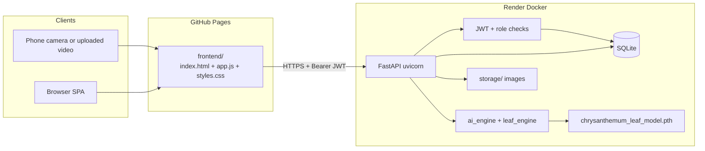
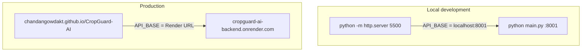
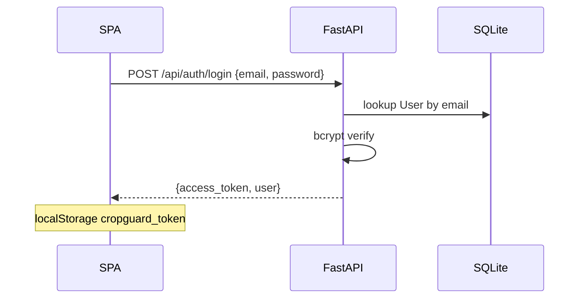
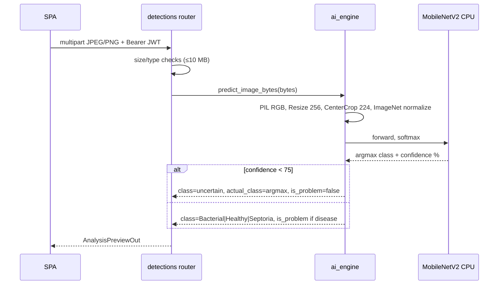
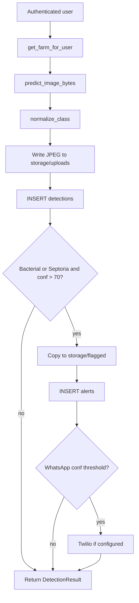
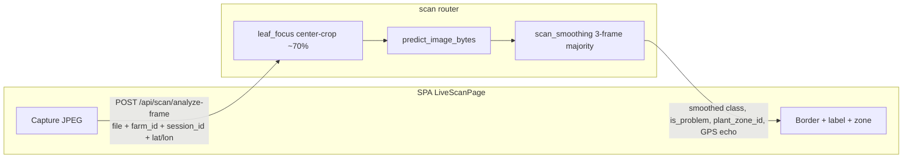
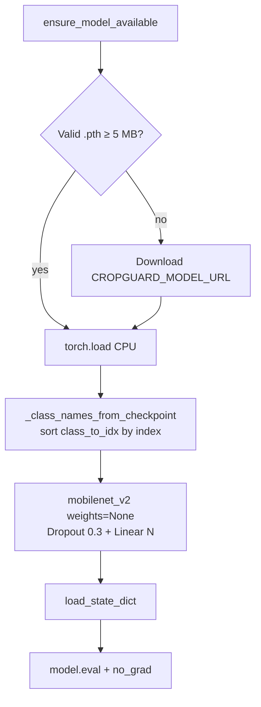
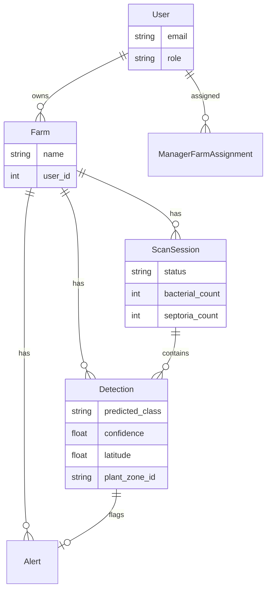

# CropGuard AI — Architecture

This document explains how CropGuard is put together: the SPA, FastAPI backend, authentication, SQLite, and the MobileNetV2 leaf classifier. It is written for engineers who have not seen the repo before.

Training code lives **outside** this git repo (sibling folder `chrysanthemum_leaf_model/`). CropGuard **loads** the exported checkpoint and serves predictions.

---

## 1. High-level system design

CropGuard is a **browser SPA + REST API + CPU PyTorch model**. There is no Node build, no Redis, and no GPU requirement. The frontend never talks to the model directly.



### Responsibilities

| Layer | Owns | Does not own |
|-------|------|----------------|
| **Frontend** (`frontend/app.js`) | Screens, camera/video capture, FormData uploads, JWT in `localStorage` | Model weights, SQL, smoothing math (server decides `is_problem` on Live Scan) |
| **API** (`backend/main.py` + routers) | Authz, validation, persistence, alerts | Training |
| **ML** (`ai_engine.py`, `leaf_engine.py`) | Load checkpoint, preprocess, softmax, confidence gate | HTTP, farms, GPS |
| **Auth** (`auth.py`) | Hash passwords, issue JWT (`sub` = email), farm scoping by role | UI routing |

### How the four pieces interact

1. **Login** — SPA `POST /api/auth/login` → API verifies bcrypt hash → JWT (HS256, 7 days, `sub` = email, `role` in payload for display). Token is sent on later calls as `Authorization: Bearer …`.
2. **Authorized request** — `get_current_user` decodes JWT, loads `User` from SQLite. Farm-scoped routes call `get_farm_for_user` (farmer = owner, manager = assignment table, admin = all).
3. **Prediction** — image bytes are passed to `predict_image_bytes` (Analysis / Live Scan) or `predict_leaf_bytes` (Leaf Scan page). Both reconstruct **MobileNetV2** with Dropout 0.3 + Linear(3), using **`class_to_idx` from the checkpoint** so softmax index matches folder names.
4. **Side effects** — save paths write files + `detections` rows; Bacterial/Septoria above threshold also write `alerts` and may fire WhatsApp/email. Live Scan **does not write the DB on every frame**.

### Runtime topology



`API_BASE` is chosen in `frontend/app.js`: hostname `localhost` → `http://localhost:8001`; otherwise Render.

CORS in `main.py` allows Pages origin and localhost. The API can also **mount** `frontend/` and serve `/` itself (useful when opening `:8001` directly).

---

## 2. Data flow for a typical request

### 2.1 Login



Failed verify → 401. Subsequent routes fail with 401 if the token is missing, expired, or the user was deleted.

### 2.2 Image analysis (preview — no DB write)

Used by **Analysis** (`POST /api/detections/analyze`).



The UI shows the overlay / badges from this JSON. Nothing is stored until the user **saves**.

### 2.3 Save to farm (prediction → DB → optional alert)

`POST /api/detections/save` with `farm_id` + file.



Batch save (`/save-batch`) repeats this per file with partial-failure lists.

### 2.4 Live Scan / uploaded video

Camera: JPEG about every **2s**. Uploaded video: **pause → analyze → seek ~1.5s** so playback cannot outrun inference.



**Critical:** analyze-frame is **stateless in the DB**. Smoothing state is **in-process memory** keyed by `session_id`. Multi-worker Render would split that memory (single Docker worker is assumed).

On End/Submit:

1. `POST /sessions/{id}/detections` — persist sampled healthy + one evidence image per problem zone  
2. `POST /sessions/{id}/complete` — status completed, email/WhatsApp session report  

Discard / page leave → `POST .../cancel`.

### 2.5 Leaf Scan page

`POST /api/detections/analyze-leaf` → `leaf_engine.predict_leaf_bytes`. Same weights and architecture as `ai_engine`, but the response includes **description + recommendation** strings. No 75% “uncertain” rewrite (Leaf Scan shows raw class + confidence).

---

## 3. Key design decisions (and why)

| Decision | Why |
|----------|-----|
| **SPA with Babel-in-browser, no npm** | Deploy is copy `frontend/` to GitHub Pages. Avoids CI Node toolchain. Cost: no tree-shaking; **no ES `import`/`export`** in `app.js`. |
| **JWT in localStorage, 7-day expiry** | Simple for a field PWA-like site. Tradeoff: XSS can steal tokens; refresh tokens were not added. |
| **SQLite** | Zero ops for a small farm SaaS and demo. On Render the file is `/tmp/cropguard.db` and **does not survive** dyno recycle — empty DB is auto-seeded. Postgres is the obvious next step. |
| **ALTER-only migrations** | `database.py` adds columns if missing. Safer for demo DBs than Alembic; you cannot rename/drop easily. |
| **3-class leaf model as the live engine** | Field problem is leaf disease, not the older 4-class plantation taxonomy. Legacy labels map via `class_constants.LEGACY_CLASS_MAP` so old rows still chart. |
| **Checkpoint `class_to_idx`, never hardcoded alphabet** | ImageFolder orders classes alphabetically (`Bacterial`, `Healthy`, `Septoria`). Hardcoding a different list swapped Healthy↔Diseased in an earlier 4-class model. Inference always sorts `class_to_idx` by index. |
| **Confidence gate at 75% → `uncertain`** | Reduces acting on blurry canopy shots. Live Scan uses a **second** gate: 3-frame majority and ≥70% before `is_problem`. |
| **Center-crop only on Live Scan** | Walking video is messy; crop biases toward a centered leaf. Analysis uploads are already close-ups — extra crop would throw away context. |
| **Analyze vs save split** | Preview is cheap and reversible. Alerts only fire on persist so farmers can reject bad frames. |
| **Shadow v2 model** | Optional second checkpoint logs agreement to CSV. Users never see v2 labels — safe A/B without UI risk. |
| **CPU PyTorch in Docker, not in requirements.txt** | Python 3.14 / slim images often lack wheels. `build.sh` pins torch 2.4.1 CPU on **3.11**. API still boots if torch is missing (`unavailable` predictions). |
| **Open-Meteo weather, 60 min cache** | No vendor API key. Cache + fallback dict avoid 429s on the dashboard. |
| **WhatsApp cooldown by farm + class + plant zone** | Stops one plant from flooding Twilio. In-memory cooldown resets on process restart. |
| **Roles** | Farmers own farms; managers walk rows; admins see the platform. Live Scan APIs allow farmer/manager/admin so a farmer is not 403’d after creating a session. |

### What was deliberately not built

- On-device TFLite / offline inference  
- YOLO leaf detector (no labeled detector weights)  
- RTSP / server OpenCV worker  
- Multi-region maps  

Those would change deploy risk and model ops; Live Scan stays “JPEG to the existing classifier.”

---

## 4. MobileNetV2 pipeline

### 4.1 Training (sibling project, not this repo)

Scripts: `chrysanthemum_leaf_model/create_leaf_split.py`, `train_leaf_model.py`, `evaluate_leaf_model.py`, `class_mapping.py`.

**Dataset.** Folders named `Bacterial`, `Healthy`, `Septoria`. Split **70 / 15 / 15**, seed **42**. Test is locked (not used for early stopping).

**Architecture.**

```
MobileNetV2 (ImageNet-1K pretrained)
  └── classifier replaced with:
        Dropout(p=0.3)
        Linear(in_features=1280, num_classes=3)
```

**Train transforms:** RandomResizedCrop 224, flips, rotation, ColorJitter, RandomErasing, ImageNet mean/std.  
**Val/test transforms (must match production):** Resize 256 → CenterCrop 224 → ToTensor → Normalize.

**Optimization (from trainer):** 25 epochs max, batch 32, Adam `lr=0.001`, weight decay `1e-4`, StepLR every 5 epochs γ=0.5, early stop patience 6. CPU or CUDA.

**Checkpoint contents** (`chrysanthemum_leaf_model.pth`):

- `model_state_dict`
- `class_names` / **`class_to_idx`** (source of truth for index → string)
- `num_classes`, `image_size`

That file is copied to CropGuard `backend/models/` and git-tracked for Render.

### 4.2 Inference (this repo)

Two loaders, one architecture:

| Entry | Used by | Extra behavior |
|-------|---------|----------------|
| `ai_engine.predict_image_bytes` | Analysis, batch, Live Scan (after optional center-crop) | If softmax max **&lt; 75%**, public `class` becomes `uncertain`; `actual_class` keeps argmax. Shadow v2 log. |
| `leaf_engine.predict_leaf_bytes` | Leaf Scan | Always returns argmax class + agronomy copy. |

Load path:



Forward pass:

1. Decode bytes with PIL → RGB  
2. `transform` → tensor `[1, 3, 224, 224]`  
3. Softmax over 3 logits  
4. `class_names[argmax]`  
5. Confidence = max probability × 100  

Device is **always CPU** in CropGuard (`torch.device("cpu")`).

### 4.3 Class mapping (the bug this design avoids)

`torchvision.datasets.ImageFolder` assigns indices in **alphabetical folder order**:

| Index | Folder name |
|------:|-------------|
| 0 | Bacterial |
| 1 | Healthy |
| 2 | Septoria |

If inference hardcoded a different order (e.g. Healthy, Diseased, …), **softmax index 0 would be labeled as the wrong disease**. A previous 4-class plantation model had Healthy↔Diseased swapped for that reason.

**Rule used everywhere now:**

```text
class_names = [name for name, idx in sorted(class_to_idx.items(), key=lambda x: x[1])]
predicted_label = class_names[argmax_index]
```

`class_mapping.verify_class_mapping()` in the training tree refuses to evaluate if checkpoint `class_to_idx` disagrees with ImageFolder on disk.

**API / DB taxonomy** (`class_constants.py`):

| Canonical | Treated as problem? | Legacy DB aliases |
|-----------|---------------------|-------------------|
| Healthy | no | `healthy` |
| Bacterial | yes | `diseased`, `pest_affected`, `bacterial` |
| Septoria | yes | `water_stressed`, `septoria` |

Scan session tables still have unused `diseased_count` / `pest_count` columns so old SQLite files keep working; new code increments `bacterial_count` / `septoria_count`.

### 4.4 Confidence and “problem” flags

```text
argmax class C, confidence P%

ai_engine (Analysis / Live raw):
  if P < 75:  expose class=uncertain, is_problem=false, keep actual_class=C
  else:       expose class=C, is_problem=(C in {Bacterial, Septoria})

Live Scan smoothing (after ai_engine):
  confirm disease only if last 3 frames majority C in PROBLEM_CLASSES
  and mean confidence ≥ 70
  then assign plant_zone_id

Persist / WhatsApp:
  typically require problem class and confidence > 70
```

Frontend Live Scan should treat **`is_problem` from analyze-frame** as the confirmation signal, not a single raw frame.

---

## 5. Persistence model (short)



Images are files on disk, not blobs in SQLite. Detection rows store `image_path`.

---

## 6. Failure modes to remember

- **No torch / no .pth** → predictions `unavailable`; UI still loads.  
- **Render cold start** → first request slow; SQLite empty after restart.  
- **Live Scan smoothing** → process-local; restart or a second worker loses the 3-frame window.  
- **Low confidence** → Analysis shows uncertain; do not treat that as Healthy.  
- **Video vs camera** → uploaded video must seek-step; camera stays wall-clock interval.

---

## 7. Where to read code next

| Question | Start here |
|----------|------------|
| App boot, CORS, routers | `backend/main.py` |
| Who can see a farm | `backend/auth.py` |
| Photo analyze/save | `backend/routers/detections.py` |
| Walk / video scan | `backend/routers/scan.py`, `scan_smoothing.py`, `leaf_focus.py` |
| Live classifier | `backend/ai_engine.py` |
| Leaf Scan copy | `backend/leaf_engine.py` |
| Index ↔ name | checkpoint `class_to_idx` + `class_constants.py` |
| SPA + API_BASE | `frontend/app.js` |
| Train the .pth | `chrysanthemum_leaf_model/train_leaf_model.py` |
